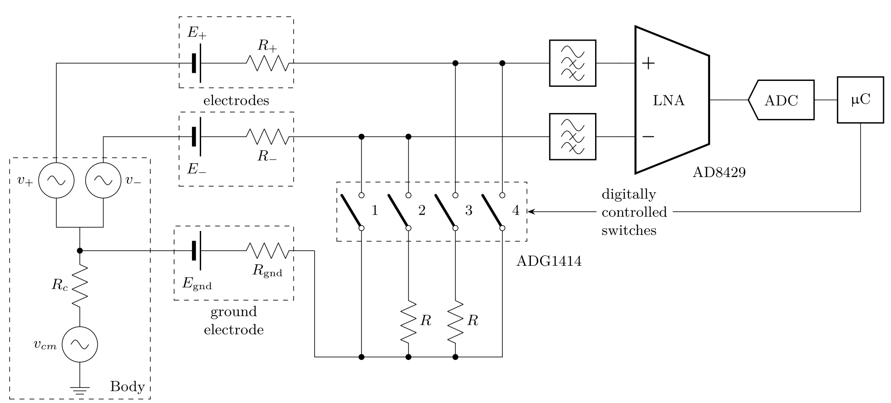

circuitikz
==========

This package provides a set of macros on top of [Ti*k*Z](https://github.com/pgf-tikz/pgf) for naturally typesetting electrical and electronic networks.

It was born mainly for writing Massimo Redaelli's exercise book and exams sheets for the Elettrotecnica courses at Politecnico di Milano, Italy. He wanted a tool that was easy to use, with a lean syntax, native to LaTeX, and supporting directly PDF output format.



--------------

## Requirements

`circuitikz` is included with the most common LaTeX systems, so it should work out of the box. Anyway, the main dependency is on Ti*k*Z/PGF, `xstring` and `siunitx` (if used):

* Tikz/PGF graphics library, version 3.1.5b
* `xstring` newer than 2009/03/13
* `siunitx`, better if `v2` or newer.

## Installation
The stable version is available on [CTAN](https://ctan.org/pkg/circuitikz?lang=en) and is included within the major latex distributions(Texlive, Miktex). If you want to test the latest version, have a look at http://circuitikz.github.io/circuitikz/. There you can find the latest git-version as a single file, just copy it to your project or to your local tex tree.

## Usage
### Stable version
Just place
```latex
  \usepackage[RPvoltages, siunitx]{circuitikz}% or your preferred options
```
Be sure to check the options you like — you should at least state one of the "voltage direction" ones, like `RPvoltages` shown above, or the usage of `siunitx` special syntax. Be sure to check the relevant sections in the manual.

For ConTeXt, you should be able to use
```latex
  \usemodule[circuitikz]
```
in the preamble and compile away, both with PS and PDF target output. 

It is higly recommended to go through the [tutorials in the manual](https://circuitikz.github.io/circuitikz/circuitikzmanualgit.pdf#c) and to learn a bit of Ti*k*Z before for example, go through at least the [basic Ti*k*Z one](https://tikz.dev/tutorial), but there are more suggestions in the documentation.

*Notice* that for the time being, due to [this bug](https://bugs.launchpad.net/ubuntu/+source/context/+bug/2058409), automatic (CI) checks for ConTeXt compatibility is disabled. I (Romano) am still checking it at home, but I am not able to have it integrated in the CI.

### Development or newer version

If you want to use the git version, go to the [GitHub page for the project](https://circuitikz.github.io/circuitikz/), download the last version (or the one you want to use)  — it's the links called "download the latest version in a single file". You will have a file called `circuitikzgit.sty` that you should put somewhere in your LaTeX input path; the best place is in the same directory where your main file live. Then, just use it instead of the normal one:

```latex
  \usepackage[siunitx, RPvoltages]{circuitikzgit}
```
or, for ConTeXt,
```latex
  \usemodule[circuitikzgit]
```

Be aware that options and style files can (and do) change between versions, so you have to check them manually, and that the recommended version is always the one that come with your TeX/LaTeX distribution; use this trick only if you *really* need a newer version!

### Older version

There is a roll-back mechanism in the package, that let you use older versions if you need them; the details are in the manual, look at the section named *"Incompatibilities between versions"*  for details.

You have all the code and the corresponding manual available in the  [in the github page](http://circuitikz.github.io/circuitikz/)  of the project, since version 0.6 onward.

## More Information and documentation
More Information can be found in the manual; you can find a compiled version for the "bleeding edge" version [in the github page](http://circuitikz.github.io/circuitikz/circuitikzmanualgit.pdf) and for the various releases in the [GitHub releases](https://github.com/circuitikz/circuitikz/releases), where you can find the manual in the assets of each release (since 0.8.3, anyways).

## Contact the authors

For bug reports and enhacement suggestions, the preferred way is to use [the issue page on the project](https://github.com/circuitikz/circuitikz/issues). Please be ready to provide an example code showing the bug, if any.

Please **do not use the issue page for generic help on how to use the package**. The manual has a (growing) set of examples; also the questions tagged `circuitikz` on  https://tex.stackexchange.com/ are often answered promptly. You can also find help on [matrix](https://app.element.io/#/room/#pgf-tikz:matrix.org) and on [TopTeX](https://topanswers.xyz/tex).

Since more or less version 0.9.0 (May 2019) Romano is the main maintainer of the project. You can contact the authors via GitHub (preferred) or via their email addresses:

* [GitHub main project page](https://github.com/circuitikz/circuitikz)
* Massimo Redaelli (m.redaelli@gmail.com)
* Stefan Lindner (stefan.lindner@fau.de)
* Stefan Erhardt (stefan.erhardt@fau.de)
* Romano Giannetti (romano.giannetti@gmail.com)

-------------
### License and copyright

This file may be distributed and/or modified

1. under the LaTeX Project Public License and/or
2. under the GNU Public License.

Copyright 2018-2024 by Romano Giannetti

Copyright 2015-2024 by Stefan Lindner

Copyright 2013-2024 by Stefan Erhardt

Copyright 2007-2024 by Massimo Redaelli


